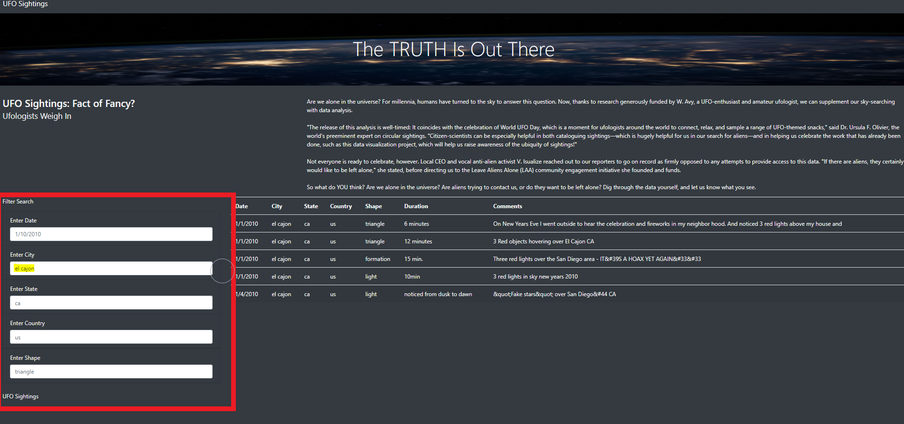

# Module 11 Using Javascipt to Create UFO Sightings Webpage
## Resources

- **Data Source:** [data.js](static_challenge/js/data.js)
- **Software:** Visual Studio Code, JavaScipt, HTML, CSS, D3, Bootstrap

## Challenge Project Overview 

Using JavaScript, HTML, and CSS, I created a custom webpage that showcases different UFO sightings worldwide. To display this data, I created a table to organize UFO data stored as a JavaScript array. This table can filter the data table array using text box search criteria set up using the JS D3 library. JavaScript was the primary coding language to program the webpage using HTML. At the same time, CSS and Bootstrap were used to help style the HTML webpage.

## Challange Project Analysis

**Result Webpages HTML Code:**
  - Webpage Filter Using Button [index_module.html](index_challenge.html)
  - Webpage Filter Using Search Bars [index_challenge.html](index_challenge.html)

### Using The Webpage

Upon entering the webpage, the user may scroll down to the bottom of the page to find a table array displaying data concerning UFO sightings, including location, the shape of UFO, event duration, and sighting description. Using the search bar to the left of the page, the user may enter text into the search filter criteria text boxes, and press enter to look up sightings particular to their interest. 

**Webpage Preview**

## Challange Project Summary

### Webpage Drawback
The placeholder text in the search filter criteria text boxes is still populated when the filter is executed. Due to the similar color palette of the placeholder text and entered text, therefore, upon viewing the webpage, it looks like the entered search doesn't match the results. 

### Webpage Improvement Recommendations 
 1) Lighten the placeholder text to almost translucent and darken the entered text, so it doesn't confuse the user, which is the entered text and placeholder text. 
 2) Add an export button so that the user may export the filtered data. 
